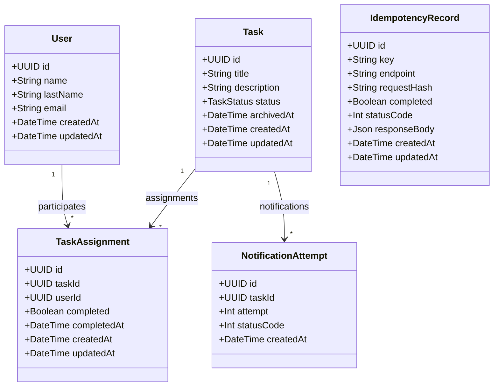

# Geest API — UML

Este documento representa el modelo de dominio principal de Geest API y las relaciones entre las entidades persistidas.

## Diagrama de clases



## Relaciones principales

`User` y `Task` mantienen una relación muchos-a-muchos mediante `TaskAssignment`. La entidad de asignación conserva el estado de participación de cada usuario (`completed` y `completedAt`), permitiendo que varios usuarios trabajen sobre una misma tarea de forma independiente.

Una `Task` puede tener múltiples `NotificationAttempt`. Cada registro permite conservar trazabilidad del número de intento y del código HTTP recibido al notificar el archivado de una tarea.

`IdempotencyRecord` es una entidad técnica independiente utilizada para persistir las claves de idempotencia, el hash de la solicitud y la respuesta asociada a operaciones `POST`.

## Flujo de arquitectura

La implementación mantiene separación entre transporte HTTP, reglas de negocio y persistencia:

```text
HTTP Request
     |
     v
Controller
     |
     v
Service
     |
     v
Repository
     |
     v
Prisma
     |
     v
PostgreSQL
```

Las operaciones `POST` pasan además por el interceptor de idempotencia antes de ejecutar el controller correspondiente.

```text
POST Request
     |
     v
IdempotencyInterceptor
     |
     v
Controller -> Service -> Repository -> PostgreSQL
```

Cuando el último usuario pendiente completa una tarea, la actualización y determinación del archivado se realizan de forma transaccional. Una vez archivada, el servicio de notificaciones realiza el envío HTTP y registra cada intento en PostgreSQL.
